# My Property Desk

My Property Desk is a web application for organising the day-to-day work of a small property portfolio. It brings property records, contacts, issues, tasks, events and notes into one workspace, with a dashboard and calendar to show what needs attention next.

The application is designed for an individual manager responsible for multiple properties. It gives operational work a clear place to live without trying to reproduce the breadth of a large property-management system.

**Live application:** [mypropertydesk.co.uk](https://mypropertydesk.co.uk/)

## A look at the application

The signed-in screenshots use synthetic records from the Daniel Mercer demo workspace.

| Public website | Portfolio dashboard |
| --- | --- |
| 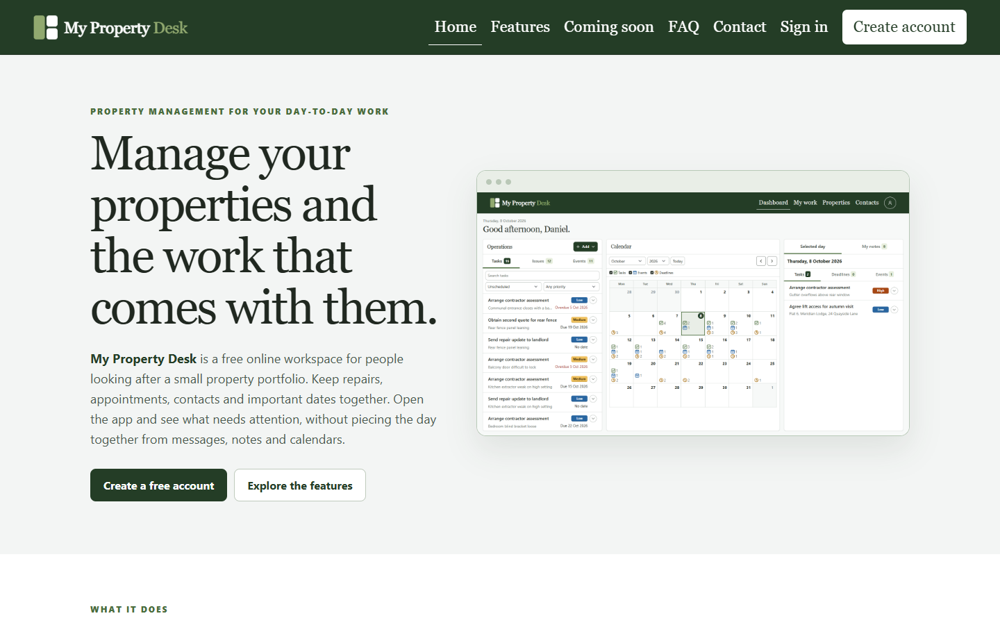 | 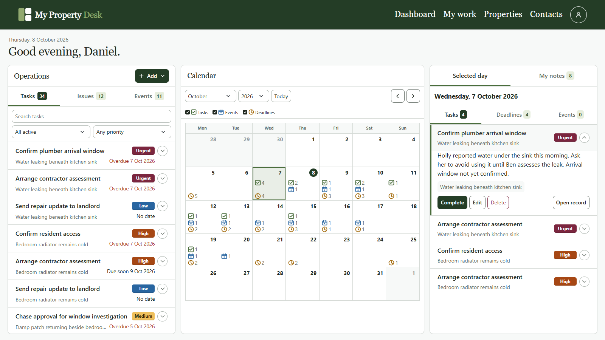 |

| Property workspace | Contacts |
| --- | --- |
| 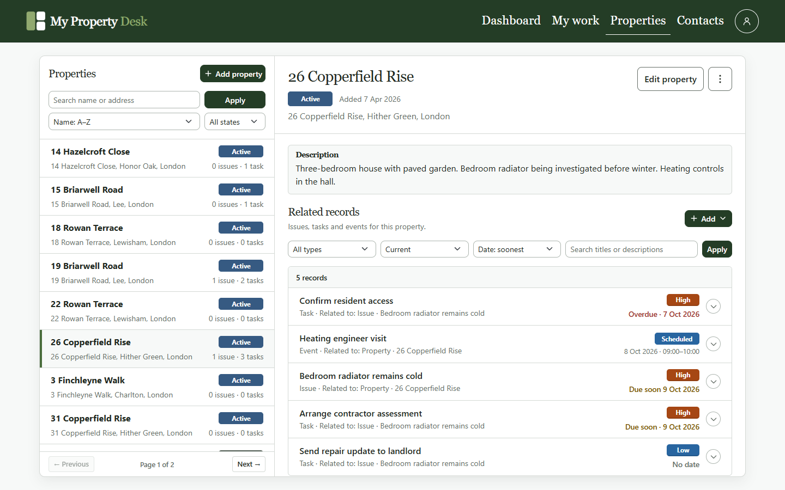 | 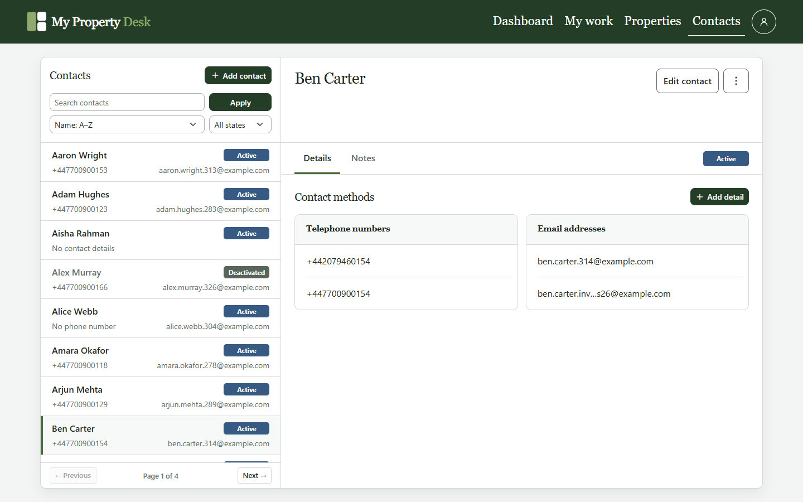 |

| Calendar on a smaller screen | Tasks on a smaller screen |
| --- | --- |
| 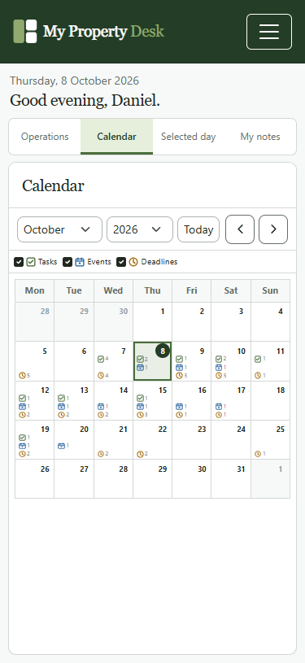 | 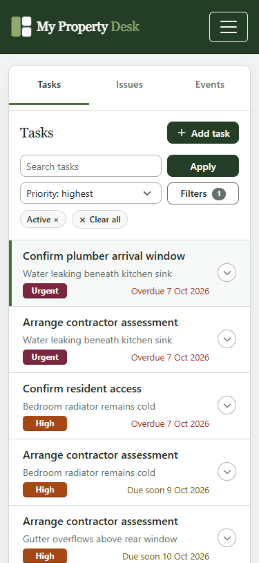 |

## What it does

- **Properties:** Keep a portfolio record with the identifying details and address of each property.
- **Contacts:** Store people and organisations involved in the work, with validated email addresses and telephone numbers.
- **Issues:** Record a problem against a property, set its priority and deadline, and resolve or dismiss it when the outcome is known.
- **Tasks:** Track work to be done.
- **Events:** Schedule appointments and other dated activity.
- **Notes:** Capture short general notes or notes associated with a contact.
- **Dashboard and calendar:** Bring current work and upcoming dates into views that support day-to-day planning.
- **Account access:** Create an account, sign in, manage account details and reset a forgotten password by email.

Records are scoped to the signed-in user. The current product is a manager's workspace: tenants, contractors, landlords and other participants are represented as contacts, rather than as users with their own accounts.

## Technology and application structure

The application uses **Python 3.14, Django 5.2 and PostgreSQL**. Django renders the pages and handles authentication, forms and database access. The signed-in dashboard also uses JSON endpoints for actions that update the page without a full reload. Styling is built with CSS and Bootstrap, with focused JavaScript for interactive parts of the interface.

The code is organised by domain (`property`, `contact`, `issue`, `task`, `event`, `note` and `accounts`). Views handle requests; selectors provide reusable, owner-scoped queries; services implement record-changing operations. Workspace helpers assemble page context.

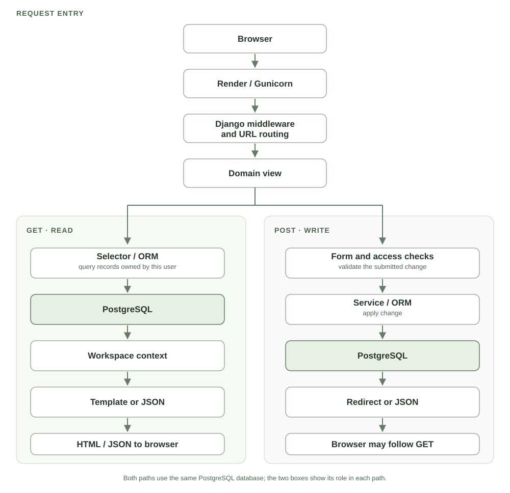

For an authenticated workspace page, the view reads the signed-in user's records and builds the context for an HTML template. A successful form submission validates input, applies a change and usually redirects to a fresh GET that queries the updated data. The dashboard also has JSON endpoints: JavaScript requests its data and sends actions without reloading the entire page. Account email flows use Django's email backend and Resend SMTP.

### Example: adding a task

The task workspace renders an Add task form. When the manager submits it, `POST /tasks/add/` reaches `add_task_view` after Django's session, authentication and CSRF handling. The view binds `TaskForm` to the submitted values and limits property and issue choices to records owned by the signed-in user.

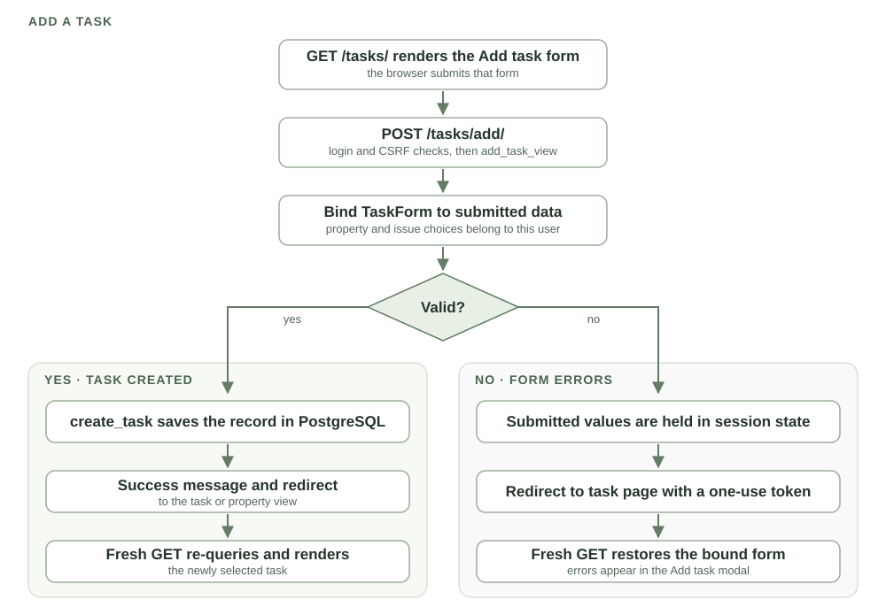

If the form is valid, the view calls `create_task`, which inserts a `Task` through the ORM. It sets a success message and redirects to the selected task, or back to the originating property when the task was added there. The new GET queries the task workspace again and renders the updated record.

If validation fails, no task is written. The view stores the submitted form values in one-use session state and redirects back to the task workspace. The GET restores a bound form from those values, so the Add task modal reopens with validation errors for the manager to correct.

### Data model

The schema is divided into three related views so the columns stay readable. Together they show every database column on the application's 12 models. Foreign keys use their database names (`user_id`, `property_id`, and so on); `nullable` identifies columns that may be empty. Every `user_id` points to `USER.id` in the account view. Those ownership lines are left out of the first two views to keep the domain relationships legible. The small `EVENT` box in the contact view is a reference to the full table above it.

#### Properties and operational work

Properties can have issues, tasks and events. An issue may have tasks of its own. Each operational record belongs to one user, even when its property or issue link is empty.

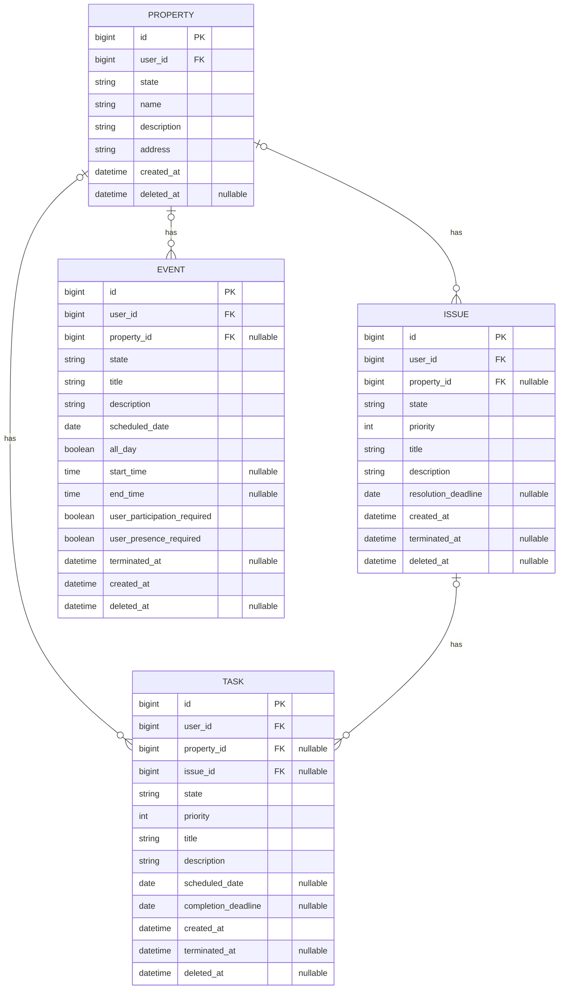

A task may link to a property or an issue, or stand alone. A database check prevents both links being set at once. Completed, resolved and dismissed records remain available as history; deactivated properties also retain their context.

#### Contacts, event participants and notes

Contacts can have multiple contact methods, and an event can include several contacts through `EVENT_CONTACT`. A note belongs to a user and may also be attached to a contact. The `EVENT` box below is a reference to its full definition in the property view.

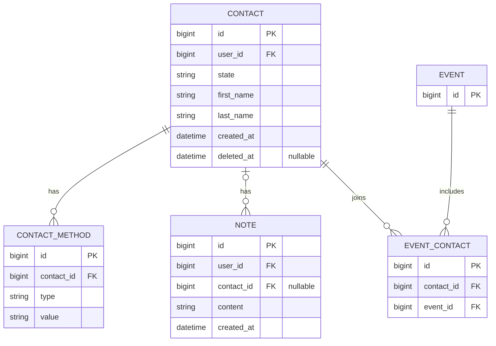

A contact can be deactivated while keeping its record and history.

#### Accounts and request controls

The custom user includes fields inherited from Django's `AbstractUser`. A pending email change belongs to exactly one user; the other two support tables have no foreign key to `USER`.

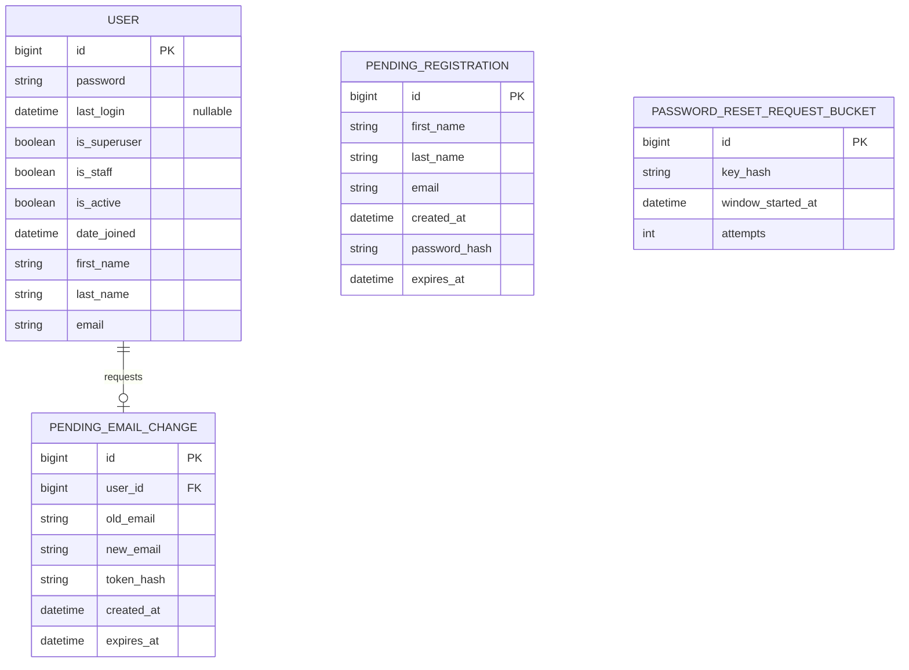

`PENDING_REGISTRATION` supports the retained email-confirmation mode. It is currently disabled in production to reduce friction at sign-up; instant registration creates a user directly. Password fields hold hashes, and reset request buckets use hashed rate-limit keys rather than storing email addresses or IPs.

## Running it locally

You will need Python 3.14 and a local PostgreSQL server. Create a local database and a role with permission to use it; the example configuration calls them `mpd` and `mpd_app`.

1. Clone the repository and create a virtual environment.

   ```powershell
   git clone https://github.com/alexander-kireev/my_property_desk.git
   cd my_property_desk
   python -m venv .venv
   .\.venv\Scripts\Activate.ps1
   python -m pip install -r requirements-dev.txt
   ```

2. Copy `.env.example` to `.env` and set the local database name, user and password. Give `MPD_SECRET_KEY` a development value. The example uses Django's console email backend, so local email appears in the terminal.

3. Apply migrations and start the server.

   ```powershell
   python manage.py migrate
   python manage.py runserver
   ```

The app will be available at `http://127.0.0.1:8000/`. `.env` contains local credentials and should stay out of version control.

## Checks and tests

Pull requests into `main` run a short GitHub Actions job: Ruff checks, Django's system check, and a check for model changes without migrations. The complete Django test suite runs only when the GitHub Actions workflow is started manually. This keeps routine pull requests quick while retaining a repeatable full-suite check before a release.

The same commands can be run locally:

```powershell
python -m ruff check accounts config contact event issue note pages property task manage.py
python manage.py check
python manage.py makemigrations --check --dry-run
python manage.py test --noinput
```

The test suite covers domain rules, account flows, public pages and dashboard behaviour. CI uses a temporary PostgreSQL database and an in-memory email backend; delivery through a real SMTP provider requires a separate manual check.

## Deployment

In production, Render runs the Django application through Gunicorn, Neon hosts PostgreSQL, and Resend delivers application email. Static files are collected during the build and served through WhiteNoise. Cloudflare Web Analytics is available on selected public pages when its token is configured; visitors can opt out through the privacy page.

Deployments are initiated deliberately rather than automatically on every push to `main`. The Render Blueprint runs database migrations before starting the updated application and checks `/health/` after it starts.

## Scope and future direction

My Property Desk currently concentrates on operational records and scheduling for one manager. It does not provide separate tenant or contractor accounts, rent collection, accounting, or lease administration.

Possible next steps include attaching photographs and documents to properties and related work, recurring tasks and reminders, and inspection checklists for visits. Connected email could keep conversations with the relevant records and make it easier to turn incoming messages into tasks, issues or events. An AI assistant could summarise history, find relevant details and suggest actions or drafts for the manager to review before anything is saved or sent. Portfolio reporting, data export and collaboration between managers may follow as the workspace grows.

## About the project

I built My Property Desk as a portfolio project and a practical exercise in modelling a real domain, implementing its rules in Django, testing the resulting behaviour, and taking the application through to deployment. The repository includes both the product and the engineering decisions that support it.
